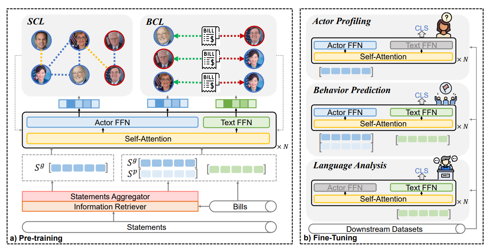

# UPPAM

This repository is the implementation of our ACL 2023 paper [UPPAM: A Unified Pre-training Architecture for Political Actor Modeling based on Language](https://virtual2023.aclweb.org/paper_P1897.html). 

## Quick Links

  - [Overview](#overview)
  - [Installation](#installation)
  - [Use UPPAM](#Use-UPPAM)
  - [Evaluation](#Evaluation)
  - [Train UPPAM](#Train-UPPAM)
    - [Data](#Data-Preparation)
    - [Training](#Training)
- [Citation](#Citation)


## Overview

In this paper, we propose a Unified Pre-training Architecture for Political Actor Modeling based on language (UPPAM). In UPPAM, we aggregate statements to represent political actors and learn the mapping from languages to representation, instead of learning the representation of particular persons. We further design structure-aware contrastive learning (SCL) and behavior-driven contrastive learning (BCL) tasks, to inject multidimensional information in the political context into the mapping. In this framework, we can profile political actors from different aspects and solve various downstream tasks. The following figure is an illustration of our models.



Part of the implementation is based on [SimCSE](https://github.com/princeton-nlp/SimCSE), many thanks to princeton-nlp for the open-source resource.


## Installation

```bash
# create environment
conda create --name uppam python=3.7
conda activate uppam
# install pytorch 1.9
pip install torch==1.9.1+cu111 torchvision==0.10.1+cu111 torchaudio==0.9.1 -f https://download.pytorch.org/whl/torch_stable.html
# install the remaining dependencies
pip install -r requirements.txt
```

The pre-trained checkpoint are available [here](https://drive.google.com/file/d/1emNwmIM1CW2Zjfk4BmuCQiKBFvPq0W2b/view?usp=sharing). Download and unzip it into the ckpt folder.

## Use UPPAM

You can use UPPAM as a backbone for various downstream tasks. (See more details in [Evaluation](#Evaluation))

Also, you can use UPPAM as a political actor encoder. By inputting the statements of a political actor to the model, you can get the representation. (See examples in [tool.py](./tool.py))

## Evaluation

Inspired by [SentEval](https://github.com/facebookresearch/SentEval), we construct [PoliEval ](./PoliEval)for evaluation on political downstream tasks.

Before evaluation, please setup the PoliEval directory by running

```bash
cd PoliEval
python setup.py install
```

Then, place data of your downstream tasks in PoliEval/data/TASKNAME. Make sure the path is consistent with that in PoliEval/polieval/engine.py.

StanceEval, FrameEval, BiasSeqEval and VoteSeqEval are provided as examples of single-label text classification, multi-label text classification, actor profiling and relation classification. You can add more datasets and Eval methods by:

- Add datasets to PoliEval/data/TASKNAME;
- Modify the engine.py to add corresponding tasks, nclasses, Eval method;
- If you need Eval method other than those we provide, you also need to define the Eval method (like the python files we have in PoliEval/polieval/) and add it to the engine.py.

We use **CongS** and **poldeb** as examples for illustration:

```bash
cd PoliEval/data/LEG_BIAS/cong_records/
bash download_dataset.sh

cd PoliEval/data/PUB_STANCE/poldeb/
bash download_dataset.sh
```

Then come back to the root directory, you evaluate UPPAM by fine-tuning on downstream datasets using our evaluation code. For example,

```bash
CUDA_VISIBLE_DEVICES=0 python evaluate.py \
    --model_name_or_path ./ckpt/uppam/ \
    --eval_tokenizer ./ckpt/uppam/ \
    --task_path ./PoliEval/data/ \
    --eval_lr 1e-5 \
    --eval_seed 42 \
    --eval_max_len 256 \
    --output_dir result/tmp \
    --do_eval \
    --eval_tasks "LEG_BIAS_cong,PUB_STANCE_poldeb" \
    --fp16 \
    "$@"
```


## Train UPPAM

### Data Preparation

0. download the processed frame, entity and sentiment indicators for subsequent use.

1. prepare the raw tweets (statements of the politicians), which will be used in the LM co-training stage and aggregated as political actor representation in SCL and BCL.

The Twitter accounts we used in pretraining are posted in [account.csv](./data/raw/account.csv). To be in compliance with Twitter’s terms of service, we only publish the ids instead of the raw data, to minimize the privacy risk.

Once the tweets are crawled, process them as txt. files (like tweet_train.txt and tweet_dev.txt in ./data/raw/) where each line is a tweet. 

Then, use the handcrafted information retriever to preprocess each politician's tweets so that we can know their statements in each policy area. In this way, we can get a hierarchical dictionary (politician: policy area: statements), where the keys are politicians and policy areas and the values are corresponding statements. 

2. prepare the samples for contrastive learning.

Based on the structural and behavioral information we mentioned in our paper, we can get a series of triples. Concretely, we store "anchor-pos" pair in csv files (e.g., all_train.csv and all_dev.csv in ./data/raw/) and randomly sample negative samples during training.

### Training

The pre-training procedure is divided into 2 steps. Firstly, we use the raw tweets to train with the MLM objective. Then, we use the tweets and processed triplets to train with the SCL and BCL objectives.

1. Perform the LM co-training and get the mlm_backbone through: 

```bash
CUDA_VISIBLE_DEVICES=0,1,2,3
NUM_GPU=4
PORT_ID=$(expr $RANDOM + 1000)
export OMP_NUM_THREADS=1
python -m torch.distributed.launch --nproc_per_node $NUM_GPU --master_port $PORT_ID train_mlm.py \
    --model_name_or_path roberta-base \
    --train_file ./data/raw/tweet_train.txt \
    --eval_file ./data/raw/tweet_dev.txt \
    --train_disk ./data/disk/mlm_train/ \
    --eval_disk ./data/disk/mlm_dev/ \
    --output_dir ./ckpt/mlm_backbone \
    --eval_tokenizer ./ckpt/mlm_backbone \
    --num_train_epochs 10 \
    --pad_to_max_length \
    --per_device_train_batch_size 32 \
    --gradient_accumulation_steps 16 \
    --learning_rate 2e-5 \
    --max_seq_length 128 \
    --warmup_steps 960 \
    --evaluation_strategy steps \
    --metric_for_best_model eval_loss \
    --load_best_model_at_end \
    --eval_steps 200 \
    --pooler_type cls \
    --mlp_only_train \
    --overwrite_output_dir \
    --logging_dir ./logs/train_mlm \
    --logging_steps 10 \
    --do_train \
    --do_eval \
    --do_mlm \
    --fp16 \
    "$@"
```

2. Based on the mlm_backbone acquired in step 1, perform SCL and BCL joint training and get UPPAM through:

```bash
CUDA_VISIBLE_DEVICES=0,1,2,3
NUM_GPU=4
PORT_ID=$(expr $RANDOM + 1000)
export OMP_NUM_THREADS=2
python -m torch.distributed.launch --nproc_per_node $NUM_GPU --master_port $PORT_ID train_joint_cl.py \
    --model_name_or_path ./ckpt/mlm_backbone/ \
    --train_file ./data/raw/all_train.csv \
    --eval_file ./data/raw/all_dev.csv \
    --train_disk ./data/disk/cl_train \
    --eval_disk ./data/disk/cl_dev \
    --output_dir ./result/uppam \
    --eval_tokenizer ./result/uppam \
    --num_train_epochs 10 \
    --pad_to_max_length \
    --per_device_train_batch_size 4 \
    --gradient_accumulation_steps 128 \
    --learning_rate 2e-5 \
    --max_seq_length 256 \
    --warmup_steps 270 \
    --cl_loss triplet \
    --act both \
    --leg_act general \
    --evaluation_strategy steps \
    --metric_for_best_model eval_loss \
    --load_best_model_at_end \
    --eval_steps 50 \
    --pooler_type cls \
    --mlp_only_train \
    --overwrite_output_dir \
    --logging_dir ./logs/train_cl \
    --logging_steps 10 \
    --do_train \
    --do_eval \
    --fp16 \
    "$@"
```


## Citations

Please consider citing this paper if you find this repository useful:


